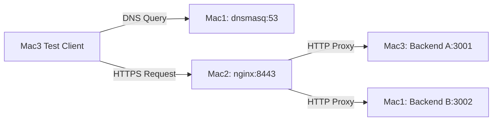

# Computer Networks Project - Architecture Document

## 1. Network Topology
The team consists of 3 MacOS machines operating on a shared private LAN.
- **Mac 1 (10.7.20.106)**: DNS Server (dnsmasq) + Backend Server B (Port 3002) + Test Client
- **Mac 2 (10.7.19.222)**: Edge / Reverse Proxy + Load Balancer (nginx) + TLS Termination
- **Mac 3 (10.7.7.23)**: Backend Server A (Port 3001)

## 2. Machine Roles and IP/Service Table
| Machine | Assigned LAN IP | Role | Services & Ports |
|---|---|---|---|
| Mac 1 (Ravleen) | 10.7.20.106 | DNS + Backend B + Client | dnsmasq (53), Backend B (3002) |
| Mac 2 (Aman) | 10.7.19.222 | Edge Load Balancer | nginx (8443, TLS) |
| Mac 3 (Ansh) | 10.7.7.23 | Backend A | Backend A (3001) |

## 3. Request-Flow Diagram showing each protocol layer
1. **DNS Resolution**: Client (Mac1) queries DNS (`app.teamX.test`) -> Mac1 dnsmasq:53 -> responds with Mac2's IP.
2. **TCP Connection**: Client initiates 3-way handshake to Mac2 on Port 8443.
3. **TLS Handshake**: Client and Mac2 negotiate TLS session (ClientHello -> ServerHello -> Certificate -> Finished).
4. **HTTP Request**: Client sends encrypted `GET /api/status` over the TLS tunnel.
5. **Reverse Proxy & Load Balancing**: Nginx on Mac2 decrypts the request and forwards it in round-robin fashion to either Backend A (Mac3:3001) or Backend B (Mac1:3002) via HTTP/1.1.
6. **HTTP Response**: The chosen backend replies with JSON body and `X-Backend` header. Nginx encrypts it and sends it back to the client.

## 4. OSI / TCP-IP Layer Mapping
- **Application Layer**: DNS (name resolution), HTTP (request/response payload)
- **Session/Presentation Layer**: TLS (encryption and certificate validation)
- **Transport Layer**: TCP (connection-oriented, reliable delivery for HTTP), UDP (connectionless delivery for DNS)
- **Network Layer**: IP (routing packets between Mac1, Mac2, Mac3 on the LAN subnet)
- **Link Layer**: Ethernet/Wi-Fi (MAC addressing for local network frame delivery)
