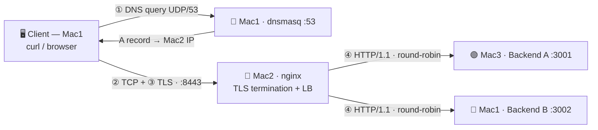

<div align="center">


<a href="https://github.com/ravleensingh/computer_networks">
  
</a>


**A client types a private domain name → our own DNS resolves it → nginx terminates TLS → one of two backends answers.**
*The application stays simple — the network is the project.*

[Overview](#-overview) · [Team](#-team) · [Architecture](#-architecture) · [Request journey](#-the-journey-of-one-request) · [Quick start](#-quick-start) · [Verify](#-verify-everything-phase-1-tasks-ag) · [Failures](#-required-failure-demonstrations) · [Troubleshooting](#-troubleshooting--check-the-layers-in-order)

</div>

---

## 🎯 Overview

This repository holds our **Computer Networks course project — Private Network Service Platform (Phase 1: Build & Observe)**: a small, fully local service environment built on our own macOS laptops (no cloud). A client machine on our private LAN:

- 🔎 resolves `app.teamX.test` through **our own DNS server** (dnsmasq),
- 🔐 opens an **HTTPS** connection to our **reverse proxy** (nginx, TLS terminated at the edge),
- ⚖️ is **load-balanced** (round-robin) to **Backend A or Backend B**,
- 🦈 and every step can be **observed** with `dig`, `curl -v`, and Wireshark.

> Replace **`teamX`** everywhere with your real team number (the project uses the reserved `.test` TLD — never `.local`, which clashes with macOS mDNS).

**Phase 1 is complete when** a client resolves `app.teamX.test`, connects over HTTPS, and receives responses from both backends through the load balancer.

| | Phase 1 — Build & Observe |
|---|---|
| **Goal** | Build the core network infrastructure and prove it works using tools |
| **Evidence** | `dig`, `curl -v`, Wireshark (DNS · TCP · TLS), cache headers, failure demos |
| **Docs** | [`Architecture_Document.md`](Architecture_Document.md) |

---

## 👥 Team

**Type 2 — 3 Macs with combined roles** (the brief allows teams of 2–3 to combine machine roles).

### Team members

| Name | Enrollment No. |
|------|----------------|
| Aman | 2401010060 |
| Ravleen Singh | 2401020052 |
| Ansh Tomar | 2401010079 |

```text
Aman 2401010060
Ravleen Singh 2401020052
Ansh Tomar 2401010079
```

### Machine roles

| Our Mac | Instructor role(s) absorbed | Services & ports |
|---------|-----------------------------|------------------|
| **Mac1** | Mac1 + Mac4 (DNS + test client + Backend B) | `dnsmasq` **:53** · `dig` · `curl` · Wireshark · **Backend B :3002** |
| **Mac2** | Mac2 (edge / reverse proxy / load balancer) | `nginx` **:8443** (TLS) · certificate · round-robin upstream |
| **Mac3** | Mac3 (Backend A) | **Backend A :3001** |

---

## 🗺️ Architecture



### Cloud equivalents

| Machine | Role | Real-world equivalent |
|---------|------|-----------------------|
| Mac1 | Private DNS server + test client | Managed DNS (Amazon Route 53) |
| Mac2 | Edge reverse proxy + load balancer + TLS | Cloud load balancer / CDN edge (AWS ALB, GCP LB) |
| Mac3 | Backend server A | Application server instance A |
| Mac1 | Backend server B | Application server instance B |

### IP / service inventory

Fill this in from `ipconfig getifaddr en0` (try `en1` if blank) on each Mac. **Never use example IPs blindly.**

| Mac | Role | LAN IP | Interface | Ports |
|-----|------|--------|-----------|-------|
| Mac1 | DNS + Backend B + client | `<Mac1_IP>` | `en0` | 53/udp+tcp, 3002 |
| Mac2 | nginx edge | `<Mac2_IP>` | `en0` | 8443 |
| Mac3 | Backend A | `<Mac3_IP>` | `en0` | 3001 |

### OSI / TCP-IP layer map

| Layer | Protocol in this project | Where you see it |
|-------|--------------------------|------------------|
| Application | **DNS**, **HTTP/1.1**, REST/JSON | `dig`, `curl -v`, `X-Backend` header |
| Session / Presentation | **TLS 1.2 / 1.3** (terminated at nginx) | ClientHello, Certificate, encrypted records |
| Transport | **TCP** (HTTPS, port 8443) · **UDP** (DNS, port 53) | SYN → SYN-ACK → ACK |
| Network | **IP** on the private LAN | `ping`, Wireshark IP headers |
| Link | Wi-Fi / Ethernet | MAC addresses on the LAN |

---

## 🚦 The journey of one request

```mermaid
sequenceDiagram
    autonumber
    participant C as Client (Mac1)
    participant D as dnsmasq (Mac1 :53)
    participant N as nginx (Mac2 :8443)
    participant B as Backend A or B

    rect rgb(30, 60, 110)
    C->>D: DNS query A app.teamX.test (UDP/53)
    D-->>C: A record = Mac2 IP
    end
    rect rgb(20, 80, 40)
    C->>N: TCP SYN
    N-->>C: SYN-ACK
    C->>N: ACK (connection established)
    end
    rect rgb(100, 75, 10)
    C->>N: TLS ClientHello
    N-->>C: ServerHello + Certificate
    C->>N: ChangeCipherSpec / Finished
    end
    rect rgb(70, 40, 110)
    C->>N: Encrypted GET /api/status
    N->>B: HTTP/1.1 (round-robin)
    B-->>N: JSON + X-Backend
    N-->>C: Encrypted 200 OK
    end
```



1. **DNS** — client asks Mac1 (`UDP/53`) for `app.teamX.test`; dnsmasq answers with **Mac2's IP**. DNS only finds the address — it does not open the connection.
2. **TCP** — SYN → SYN-ACK → ACK to Mac2 `:8443` creates a reliable, ordered, connection-oriented channel *before* any TLS/HTTP data.
3. **TLS** — ClientHello → ServerHello + Certificate → key exchange → Finished. After ChangeCipherSpec the HTTP payload is **encrypted**, which is why Wireshark shows only *Application Data*.
4. **HTTP** — nginx decrypts, then makes a *separate* plain-HTTP/1.1 request to Backend A or B (round-robin). The backend replies with JSON + `X-Backend`.
5. The client never knows the backend IPs — it only knows `app.teamX.test:8443`.

---

## 📁 Repository structure

```text
computer_networks/
├── README.md                      # ← you are here
├── Architecture_Document.md       # topology, IP/service table, request-flow, layer mapping
├── backend-a/server.py            # Backend A — Mac3, port 3001
├── backend-b/server.py            # Backend B — Mac1, port 3002 (identical code)
├── dns/
│   └── dnsmasq.conf               # private DNS (Mac1)
├── nginx/
│   ├── nginx.conf                 # edge proxy + round-robin LB + TLS (Mac2)
│   └── setup_mac2.sh              # automated Mac2 deployment
├── tls/
│   ├── openssl.cnf                # cert request config (CN + SAN)
│   └── generate_cert.sh           # self-signed cert generator (*.key / *.crt not tracked)
├── evidence/                      # screenshots + captures (not pushed)
└── .gitignore
```

---

## 🚀 Quick start

### Prerequisites

```bash
# Mac1
brew install dnsmasq wireshark python
# Mac2
brew install python nginx openssl wireshark
# Mac3
brew install python
```

All three Macs must be on the **same private Wi-Fi/LAN**. Verify with `ping -c 4 <IP>` between every pair, and allow incoming connections if the macOS firewall prompts for `dnsmasq` / `nginx` / `python`.

### ⏱️ Startup order (use before every demo)

| # | Mac | Action |
|---|-----|--------|
| 1 | **Mac3** | Start Backend A |
| 2 | **Mac1** | Start Backend B, then dnsmasq |
| 3 | **Mac2** | Start (or restart) nginx |
| 4 | **Mac1** | Final checks from the client |

### 1️⃣ Backends (identical code, different arguments)

Both backends use the **same `server.py`**; only the startup arguments change. They bind to `0.0.0.0` so other Macs can reach them.

```bash
# Mac3 — Backend A
cd backend-a/
python3 server.py A 3001
```

```bash
# Mac1 — Backend B
cd backend-b/
python3 server.py B 3002
```

```bash
# Local sanity check on each Mac (X-Backend must show A or B, HTTP 200)
curl -i http://127.0.0.1:3001/api/status   # Mac3
curl -i http://127.0.0.1:3002/api/status   # Mac1
```

### 2️⃣ Private DNS (Mac1)

Copy `dns/dnsmasq.conf` to `~/CN-Project/dns/`, replace `<Mac1_LAN_IP>` and `<Mac2_IP>`, then:

```bash
dnsmasq --test -C ~/CN-Project/dns/dnsmasq.conf
sudo dnsmasq --keep-in-foreground --conf-file=$HOME/CN-Project/dns/dnsmasq.conf
```

Key lines:

```text
port=53
listen-address=<Mac1_LAN_IP>      # LAN IP, NOT 127.0.0.1 — otherwise other Macs cannot use it
bind-interfaces
no-resolv
server=1.1.1.1
address=/app.teamX.test/<Mac2_IP>
address=/api.teamX.test/<Mac2_IP>
address=/teamX.test/<Mac2_IP>
```

Point the client Macs (at least two) at Mac1 for DNS:

```bash
sudo networksetup -setdnsservers "Wi-Fi" <Mac1_IP>
networksetup -getdnsservers "Wi-Fi"
dscacheutil -flushcache && sudo killall -HUP mDNSResponder
dig app.teamX.test        # ANSWER must be Mac2's IP; SERVER must be Mac1's IP
```

### 3️⃣ Edge reverse proxy + TLS (Mac2)

**Quick setup**

```bash
cd nginx/
./setup_mac2.sh <Mac1_IP> <Mac3_IP>
```

**Manual setup**

1. Generate the self-signed certificate (CN + SAN = `app.teamX.test`, `api.teamX.test`):
```bash
   cd tls/
   ./generate_cert.sh
```
2. Deploy the nginx config (replace `<Mac1_IP>`, `<Mac3_IP>`, `<YOUR_USERNAME>` first):
```bash
   cp "$(brew --prefix)/etc/nginx/nginx.conf" ~/CN-Project/nginx/nginx.conf.backup   # rollback copy
   mkdir -p ~/CN-Project/tls
   cp tls/app.teamX.test.crt tls/app.teamX.test.key ~/CN-Project/tls/
   chmod 600 ~/CN-Project/tls/app.teamX.test.key
   sudo cp nginx/nginx.conf "$(brew --prefix)/etc/nginx/nginx.conf"
   nginx -t                        # must say: syntax is ok / test is successful
   brew services start nginx       # or: brew services restart nginx
   lsof -nP -iTCP:8443 -sTCP:LISTEN
```
3. Trust the certificate on Mac2:
```bash
   sudo security add-trusted-cert -d -r trustRoot \
     -k /Library/Keychains/System.keychain ~/CN-Project/tls/app.teamX.test.crt
```
4. Send **only the `.crt`** to Mac1 and Mac3 (AirDrop or `scp`), then in **Keychain Access** → login keychain → open the cert → *Trust* → **Always Trust**.

The heart of `nginx/nginx.conf`:

```nginx
upstream backend_pool {
    server <Mac3_IP>:3001;   # Backend A (Mac3)
    server <Mac1_IP>:3002;   # Backend B (Mac1)
}

server {
    listen 8443 ssl;
    server_name app.teamX.test;

    ssl_certificate     /Users/<YOUR_USERNAME>/CN-Project/tls/app.teamX.test.crt;
    ssl_certificate_key /Users/<YOUR_USERNAME>/CN-Project/tls/app.teamX.test.key;
    ssl_protocols       TLSv1.2 TLSv1.3;

    location / {
        proxy_pass         http://backend_pool;
        proxy_http_version 1.1;
        proxy_set_header   Host $host;
        proxy_set_header   X-Real-IP $remote_addr;
        proxy_set_header   X-Forwarded-Proto https;
    }
}
```

> 🔐 **Security:** the private key (`app.teamX.test.key`) **never leaves Mac2** and is never committed. Port `8443` is used instead of `443` (allowed by the brief).

### 🌐 Endpoints

| Endpoint | Response |
|----------|----------|
| `GET /` | JSON confirming the service is running |
| `GET /api/status` | `{"backend": "A/B", "status": "ok"}` + `X-Backend` header |
| `GET /api/cache` | `Cache-Control: max-age=60` + `ETag: "cache-v1"`; returns **304** on matching `If-None-Match` |

---

## ✅ Verify everything (Phase 1, tasks A–G)

> ⚠️ **Never use `curl -k`** — certificate validation must not be bypassed. Always use the **domain name**, never an IP, in the URL.

| Task | What to prove | Command (run from a client Mac) | Pass condition |
|------|---------------|---------------------------------|----------------|
| **A** · LAN | All Macs reach each other | `ping -c 4 <IP>` for every pair | 0% loss |
| **B** · DNS | Name resolves via *our* DNS | `dig app.teamX.test` | ANSWER = Mac2 IP · `SERVER` = Mac1 IP |
| **B** · private | Name is not public | `dig @8.8.8.8 app.teamX.test` | `NXDOMAIN` |
| **C** · Backends | Both respond | `curl -i http://127.0.0.1:3001/api/status` and `:3002` | 200 + `X-Backend` |
| **D** · LB | Round-robin A ↔ B | see loop below | both `A` and `B` appear |
| **E** · HTTPS | Valid TLS, no `-k` | `curl -v https://app.teamX.test:8443/` | TLS handshake, cert matches domain, 200 |
| **F** · Caching | `Cache-Control` + 304 | see below | `max-age=60`, `ETag`, then `304` |
| **G** · Packets | DNS + TCP + TLS in Wireshark | filters below | all three layers visible |

**Load balancing (D)**

```bash
for i in {1..10}; do
  echo -n "Request $i: "
  curl -s -D - https://app.teamX.test:8443/api/status -o /dev/null | grep -i "^X-Backend"
done

for i in {1..6}; do curl -s https://app.teamX.test:8443/api/status; echo; done
```

**HTTPS + HTTP/1.1 (E)**

```bash
curl -v https://app.teamX.test:8443/
curl --http1.1 -i https://app.teamX.test:8443/api/status
openssl x509 -in ~/CN-Project/tls/app.teamX.test.crt -noout -subject -issuer -dates -ext subjectAltName
```

**Caching (F)**

```bash
curl -i  https://app.teamX.test:8443/api/cache                               # Cache-Control + ETag
curl -sI https://app.teamX.test:8443/api/cache                               # headers only
curl -i -H 'If-None-Match: "cache-v1"' https://app.teamX.test:8443/api/cache # → 304 Not Modified
```

| Case | Meaning |
|------|---------|
| Fresh cache hit | Stored copy is within `max-age` — reused with **no** request to the server |
| Conditional request | After expiry the client asks "is my copy still valid?" via `If-None-Match` |
| `304 Not Modified` | Copy still valid — headers only, **no body** re-sent |
| Full new request | Client has no valid copy and receives the full body |

**Wireshark (G)** — capture on the client's Wi-Fi interface (e.g. `en0`) while running `dig app.teamX.test` and `curl -v https://app.teamX.test:8443/api/status`:

| Layer | Display filter | Look for |
|-------|----------------|----------|
| DNS | `dns` | Query `A app.teamX.test` client → Mac1 `:53/UDP`; response with Mac2's IP and TTL |
| TCP | `tcp.flags.syn==1` | SYN (ephemeral port → `:8443`) → SYN-ACK → ACK; Seq/Ack numbers |
| TLS | `tls` | ClientHello (version, ciphers) → ServerHello + Certificate → ChangeCipherSpec → *Application Data* only |
| All | `udp.port == 53 or tcp.port == 8443` | Ports: `53/UDP` for DNS, `8443/TCP` for HTTPS, plus the client's ephemeral source port |

Save the capture under `evidence/` (large binaries such as `*.pcapng` are git-ignored — share manually).

---

## 💥 Required failure demonstrations

Break **one thing at a time**, observe, explain which **layer** failed, then **restore**.

| Scenario | Action | Expected observation | Layer |
|----------|--------|----------------------|-------|
| **Stop one backend** | `Ctrl+C` Backend A, then repeat the LB loop | Responses show `X-Backend: B` only | Application / edge |
| **Wrong DNS server** | `sudo networksetup -setdnsservers "Wi-Fi" 8.8.8.8` + flush cache, then `dig app.teamX.test` | Lookup fails (`NXDOMAIN`) but `ping <Mac2_IP>` still works | DNS (IP unaffected) |
| **Wrong port** | `curl -v https://app.teamX.test:8999/` | DNS resolves, host reachable, TCP *connection refused* | Transport (TCP) |

**Restore after each test:**

```bash
# Backend A (Mac3)
cd backend-a/ && python3 server.py A 3001

# Client DNS
sudo networksetup -setdnsservers "Wi-Fi" <Mac1_IP>
dscacheutil -flushcache && sudo killall -HUP mDNSResponder
```

---

## 🩺 Troubleshooting — check the layers in order

| Layer | First check | If it fails |
|-------|-------------|-------------|
| **DNS** | `dig app.teamX.test` | dnsmasq running on Mac1? port 53? config valid? client DNS setting? |
| **TCP / port** | `nc -vz <Mac2_IP> 8443` | nginx running and listening on Mac2? firewall? |
| **TLS** | `curl -v https://app.teamX.test:8443/` | cert path/trust/SAN, hostname, nginx `ssl_*` settings |
| **HTTP / app** | `curl -i https://app.teamX.test:8443/api/status` | Backend A, Backend B, nginx upstream block |

```bash
# DNS
lsof -nP -iUDP:53 -iTCP:53
dnsmasq --test -C ~/CN-Project/dns/dnsmasq.conf
dig @<Mac1_IP> app.teamX.test
networksetup -getdnsservers "Wi-Fi"

# nginx
nginx -t
lsof -nP -iTCP:8443 -sTCP:LISTEN
tail -f /opt/homebrew/var/log/nginx/error.log

# Backends
lsof -nP -iTCP:3001 -sTCP:LISTEN
lsof -nP -iTCP:3002 -sTCP:LISTEN

# Certificate
openssl x509 -in ~/CN-Project/tls/app.teamX.test.crt -noout -subject -ext subjectAltName
```

---

## 🗂️ Deliverables map

| Deliverable | Where |
|-------------|-------|
| Architecture document (topology, IP/service table, request flow) | [`Architecture_Document.md`](Architecture_Document.md) |
| Configuration bundle (dnsmasq, nginx, TLS notes) | [`dns/`](dns), [`nginx/`](nginx), [`tls/`](tls) |
| Backend source code | [`backend-a/`](backend-a), [`backend-b/`](backend-b) |
| Evidence folder (screenshots, captures) | `evidence/` — kept locally / shared manually |

<details>
<summary><b>📸 Evidence checklist (click to expand)</b></summary>

- [ ] IP table for all Macs · ping between every pair
- [ ] Backend A and Backend B running (`X-Backend` visible)
- [ ] `dig @<Mac1_IP>` and plain `dig app.teamX.test` · `dig @8.8.8.8` → `NXDOMAIN`
- [ ] Certificate details (CN + SAN) · `curl -v https://app.teamX.test:8443/` with **no `-k`**
- [ ] Load balancing — `A` and `B` alternating
- [ ] `Cache-Control` / `ETag` and the `304` response
- [ ] Wireshark: DNS · TCP handshake · TLS handshake (+ saved `.pcapng`)
- [ ] Failure demo recorded **and restored**

</details>

---

## 🔒 Repository hygiene

- 🚫 **Never commit** private keys or generated certs (`tls/*.key`, `tls/*.crt` are git-ignored).
- 🚫 Wireshark captures (`*.pcapng`) and screenshots (`evidence/*.png`) are git-ignored — share them manually.
- 🚫 Per-Mac terminal command logs (`mac1userterminalcommand`, `mac2userterminalcommand`, `mac3userterminalcommand`) are **local collaboration files only** and stay out of Git.
- ✅ Only the **public** `.crt` is ever distributed to client Macs.

<div align="center">

<sub>Built on three MacBooks, one private LAN, and a lot of <code>dig</code>. 🛰️</sub>


</div>
